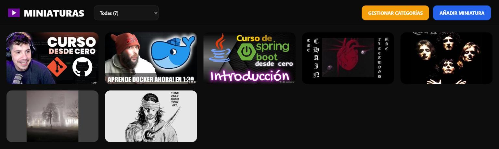
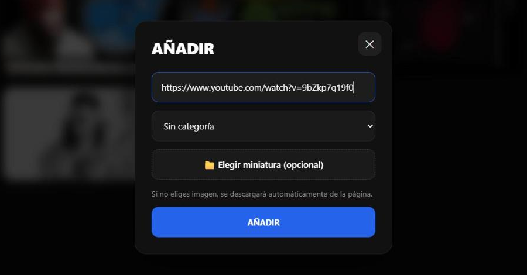
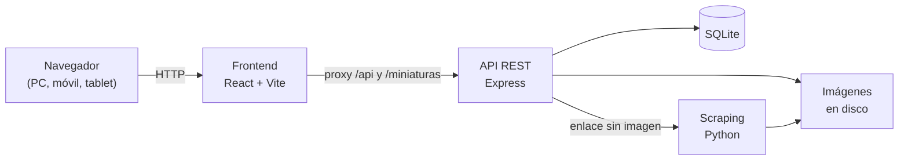

<div align="center">

# 🖼️ Miniaturas

**Guarda tus enlaces como miniaturas, organízalos por categorías y ábrelos desde cualquier dispositivo de tu casa.**

[](https://nodejs.org)
[](https://expressjs.com)
[](https://www.sqlite.org)
[](https://react.dev)
[](https://vite.dev)
[](https://www.python.org)
[](LICENSE)



</div>

## ¿Qué es?

Los enlaces que queremos guardar (vídeos, cursos, artículos…) acaban perdidos entre marcadores, notas y chats. **Miniaturas** los reúne en una galería visual: cada enlace se muestra con su imagen de vista previa, que se descarga automáticamente de la página, y se organiza en categorías. La aplicación se ejecuta en tu ordenador y puedes usarla también desde el móvil o la tablet, conectados a la misma red wifi.

## Funcionalidades

- **Añadir enlaces con o sin imagen**: si no subes una, se descarga automáticamente la imagen de vista previa de la página (`og:image`).
- **Editar, mover y borrar** miniaturas con clic derecho, o con el botón `⋯` en pantallas táctiles.
- **Categorías**: crear, renombrar y eliminar. Al eliminar una, sus miniaturas pasan a «Sin categoría».
- **Filtro por categoría** con contador, que se recuerda entre visitas.
- **Acceso desde la red local**, con la IP detectada automáticamente.
- **Revisión al arrancar**: se descargan las miniaturas que falten.
- **Diseño responsive** para ordenador, tablet y móvil.

<div align="center">
  
  &nbsp;
  
</div>

## Tecnologías

| Capa           | Tecnología                                               |
| -------------- | -------------------------------------------------------- |
| Backend (API)  | Node.js · Express 5 · Multer                             |
| Base de datos  | SQLite (better-sqlite3)                                  |
| Frontend       | React 19 · Vite 8 · CSS                                  |
| Scraping       | Python · Requests · BeautifulSoup                        |
| Arranque       | Scripts para Windows (`run.bat`) y Linux/macOS (`run.sh`) |

## Requisitos

| Herramienta | Versión                                 | Descarga                                   |
| ----------- | --------------------------------------- | ------------------------------------------ |
| Node.js     | 20 o superior (probado con 22.18)       | [nodejs.org](https://nodejs.org)           |
| Python      | 3.10 o superior (probado con 3.13)      | [python.org](https://www.python.org)       |
| Git         | Cualquier versión reciente              | [git-scm.com](https://git-scm.com)         |

> En Windows, al instalar Python marca la casilla **«Add python.exe to PATH»**.

## Instalación rápida

```bash
# 1. Clonar el repositorio
git clone https://github.com/walteralee/Miniaturas.git

# 2. Entrar en la carpeta
cd Miniaturas

# 3. Arrancar (Windows)
.\run.bat
#    Arrancar (Linux / macOS)
./run.sh
```

El script comprueba los requisitos, instala las dependencias (la primera vez tarda 1-2 minutos), arranca los servidores y abre el navegador. Te preguntará el modo:

1. **Solo este ordenador** → `http://localhost:5173`
2. **Red local** → muestra la dirección para abrirla desde el móvil o la tablet.

Para saltarte la pregunta: `run.bat local`, `run.bat red`, `./run.sh local` o `./run.sh red`.

La primera vez se carga contenido de ejemplo para que veas la aplicación funcionando.

## Configuración

No hace falta configurar nada. Si quieres cambiar los puertos, copia `.env.example` como `.env` y edítalo:

| Variable        | Por defecto | Descripción                                                  |
| --------------- | ----------- | ------------------------------------------------------------ |
| `FRONTEND_PORT` | `5173`      | Puerto de la interfaz web (el que se abre en el navegador)   |
| `BACKEND_PORT`  | `3000`      | Puerto de la API (solo accesible desde este equipo)          |

## Arquitectura



- El navegador solo habla con Vite, que reenvía las peticiones a la API. Por eso la API escucha únicamente en `127.0.0.1`, no queda expuesta a la red y no hace falta configurar IPs.
- La API sigue una arquitectura por capas: **rutas → controladores → servicios → repositorios**, con validación de datos y errores centralizados.
- Las subidas se validan (solo JPG, PNG, WEBP, GIF o AVIF; máximo 10 MB) y la base de datos se crea automáticamente al arrancar.

### API

| Método   | Ruta                            | Descripción                                          |
| -------- | ------------------------------- | ---------------------------------------------------- |
| `GET`    | `/api/miniaturas`               | Lista las miniaturas                                 |
| `POST`   | `/api/miniaturas`               | Crea una (`url`, `categoriaId` e imagen opcional)    |
| `PUT`    | `/api/miniaturas/:id`           | Actualiza el enlace y/o la imagen                    |
| `PUT`    | `/api/miniaturas/:id/categoria` | Mueve una miniatura a otra categoría                 |
| `DELETE` | `/api/miniaturas/:id`           | Borra una miniatura                                  |
| `GET`    | `/api/categorias`               | Lista las categorías                                 |
| `POST`   | `/api/categorias`               | Crea una categoría                                   |
| `PUT`    | `/api/categorias/:id`           | Renombra una categoría                               |
| `DELETE` | `/api/categorias/:id`           | Elimina una categoría                                |

Los errores devuelven el código HTTP adecuado (`400`, `404`, `500`) y un JSON con el mensaje: `{ "error": true, "mensaje": "La URL no es válida" }`.

## Estructura del proyecto

```
Miniaturas/
├── backend/                 API REST (Node.js + Express)
│   ├── src/
│   │   ├── rutas/           Definición de endpoints
│   │   ├── controladores/   Entrada y salida HTTP
│   │   ├── servicios/       Lógica de negocio
│   │   ├── repositorios/    Acceso a SQLite
│   │   ├── validadores/     Validación de datos
│   │   ├── middlewares/     Subida de imágenes y errores
│   │   └── ...
│   └── test/                Tests de la API (npm test)
├── frontend/                Interfaz web (React + Vite)
│   └── src/
│       ├── componentes/     Galería, ventanas y barra superior
│       ├── hooks/           Estado y carga de datos
│       ├── servicios/       Cliente de la API
│       └── estilos/
├── scripts/
│   ├── scraping.py          Descarga de miniaturas
│   └── arranque.mjs         Comprobaciones de run.bat y run.sh
├── almacenamiento/
│   ├── recursos/            Imagen por defecto y contenido de ejemplo
│   ├── datos/               Base de datos (se genera, fuera de Git)
│   └── miniaturas/          Imágenes (se generan, fuera de Git)
├── run.bat / run.sh         Arranque con un comando
└── .env.example             Plantilla de configuración
```

## Ejecución manual (desarrollo)

Si prefieres arrancar cada parte por separado, en dos terminales:

```bash
cd backend && npm install && npm run dev     # API con recarga automática
cd frontend && npm install && npm run dev    # Interfaz (añade "-- --host" para la red local)
```

Para descargar imágenes automáticamente, instala también las dependencias de Python: `pip install -r scripts/requirements.txt`.

## Tests

La API tiene 23 tests de integración escritos con el runner nativo de Node (sin dependencias extra). Cubren la creación, edición, borrado y validación de miniaturas y categorías, y los errores HTTP:

```bash
cd backend
npm install
npm test
```

Cada ejecución usa una carpeta de datos temporal, así que no toca tus datos y no necesita conexión a internet.

## Problemas frecuentes

<details>
<summary><b>«El puerto 3000 (o 5173) está ocupado»</b></summary>

Otro programa, o una ejecución anterior de Miniaturas, ya usa ese puerto. Cierra las ventanas «Miniaturas - Backend» y «Miniaturas - Frontend», o cambia el puerto en `.env` (ver [Configuración](#configuración)).
</details>

<details>
<summary><b>«No se encuentra Python 3.10 o superior» (Windows)</b></summary>

Instala Python desde [python.org](https://www.python.org) marcando **«Add python.exe to PATH»**. Si al escribir `python` se abre la Microsoft Store, desactiva los alias en *Configuración → Aplicaciones → Alias de ejecución de aplicaciones*.
</details>

<details>
<summary><b>«No se pudo crear el entorno de Python» (Debian / Ubuntu)</b></summary>

Instala el módulo de entornos virtuales: `sudo apt install python3-venv`.
</details>

<details>
<summary><b>Desde el móvil no carga la página</b></summary>

- Arranca en modo **red local** (opción 2 o `run.bat red`).
- El móvil tiene que estar en **la misma red wifi** que el ordenador.
- En Windows, cuando el firewall pregunte por Node.js, pulsa **«Permitir acceso»** en redes privadas.
</details>

<details>
<summary><b>Una miniatura aparece con la imagen por defecto</b></summary>

Esa página no ofrece imagen de vista previa (por ejemplo, X/Twitter sin iniciar sesión). Usa **Actualizar** en el menú de la miniatura y sube la imagen a mano.
</details>

<details>
<summary><b>Quiero empezar de cero</b></summary>

Borra las carpetas `almacenamiento/datos` y `almacenamiento/miniaturas`. En el siguiente arranque se vuelve a crear todo con el contenido de ejemplo.
</details>

## Autor

**Walter Alejandro Cutiño Ledo**

[](https://github.com/walteralee)
[](https://www.linkedin.com/in/walter-cutino-ledo/)

## Licencia

Distribuido bajo la licencia MIT. Consulta [LICENSE](LICENSE) para más información.
